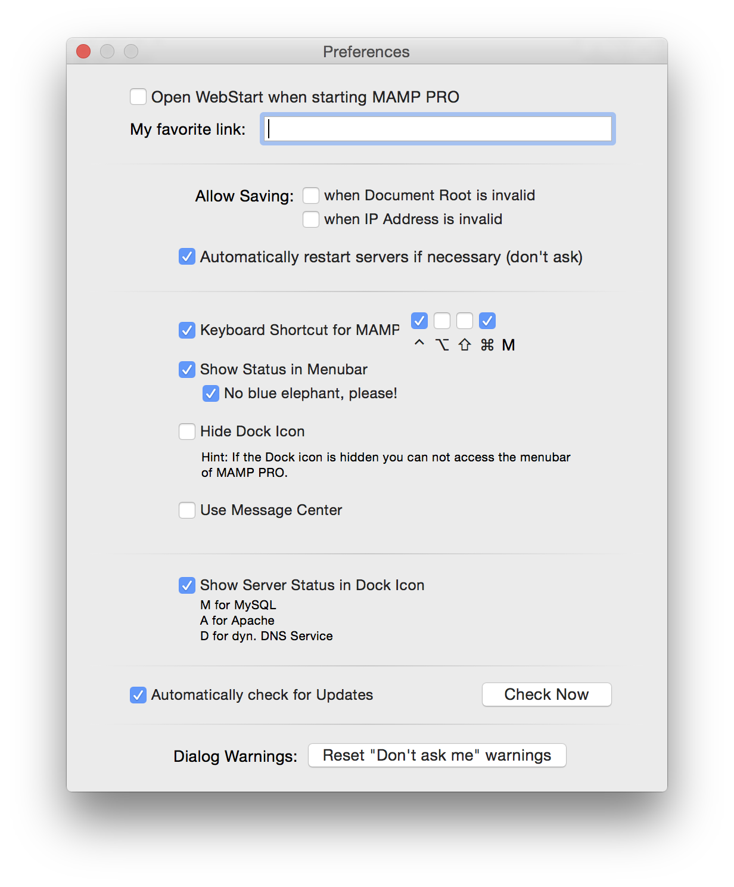

## Menu

### MAMP PRO

#### Check For Updates

Check MAMP PRO updates checks for updates to the MAMP PRO application. It does not check for new versions of individual components.

---

#### About MAMP PRO

Check your version number and MAMP PRO key.

---

#### Preferences…

*  **Open WebStart when starting MAMP PRO:**
     Your default browser will bring up the web start page when MAMP PRO is launched.

*  **Path To Webstart:**
     The default MAMP start page provides links to access utilities such as phpMyAdmin, phpInfo, SQLite Manager,       phpLiteAdmin, FAQ, and the MAMP Website.

---

When left using the default setting (`/MAMP/`), you will be directed to the MAMP PRO utilities start page using the Alias definition `/MAMP/`. If this field is left blank, you will be taken to your default document root (http://localhost:8888 in the `/Applications/MAMP/htdocs`). If you enter /subDirectory in this field, you will be taken to the `/Applications/MAMP/htdocs/subDirectory` folder via your default web browser (http://localhost:8888/subDirectory).

 

*  **Allow Saving when Document Root is invalid:**
     MAMP PRO will ignore invalid paths to hosts and proceed with saving your settings.

--- 

*  **Allow Saving when IP Address is invalid:**
     MAMP PRO will ignore invalid IP addresses for hosts and proceed with saving your settings.

     

     Note: Setting these options may prevent Apache from starting up.
     

*  **Automatically Restart Servers if necessary (don’t ask):**
     MAMP PRO will automatically restart when changes are made that require a restart.

---

*  **Keyboard shortcut for MAMP:**
Only M cannot be used as a shortcut key. The ^ key stands for the ctrl key.

*  **Show Status in Menu Bar:**
     The elephant icon will appear in the Menu Bar. When MAMP PRO has the servers running the elephant icon will be blue,         when the servers are not running the elephant will be black.

*  **Hide Doc Icon:**
     The Doc Icon will be hidden. This option will only take affect after the restart of MAMP PRO.

     

     Note: You will not be able to see the MAMP PRO Menu Bar.
     

*  **Use Message Center (OS X 10.9 or later):**
     The Message Center will inform you of when Apache and MySQL have started. The Message Center can only be used when the       doc icon is hidden.

---

*  **Automatically Check For Updates:**
     You will be notified when a new MAMP PRO update is available. 
