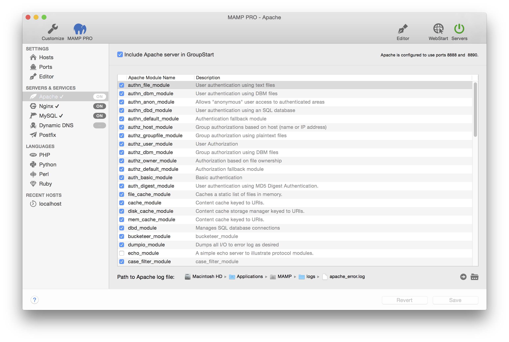

## Servers and Services > Apache

*  **Activate Apache server**  

---

### Apache Modules

The Apache Web Server installed by MAMP PRO comes with many modules pre-installed.

The web server modules can be activated or deactivated depending on your needs. Module Description provides information pertaining to features and functions of the selected module.

To enable the PHP scripting language you must activate the php_module, if you want to use Python you need mod_wsgi module, Perl needs perl_module. In order to switch to CGI mode and use multiple PHP versions you must activate cgi_module.

Information on custom configuring your MAMP PRO Apache Server installation can be found [here](../../Settings/Hosts/Apache) .

For further information on Apache Server see [https://httpd.apache.org](https://httpd.apache.org).

