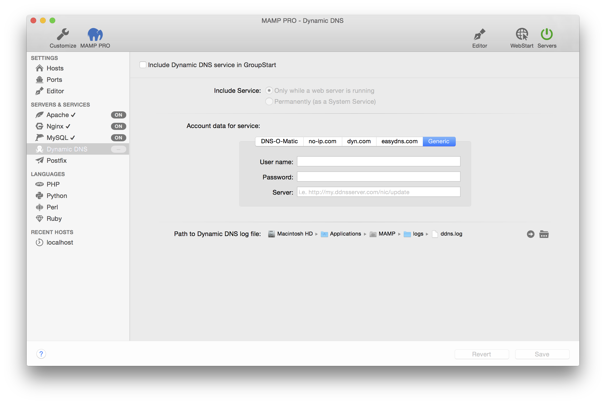

## Servers and Services > Dynamic DNS

If you would like to make your hosts accessible from the internet (Don't forget about security then!), but do not have a domain name that points to your Mac, you will need a Dynamic DNS Service. 

If your network is connected to the internet via a router and it can handle Dynamic DNS Services, then you don’t need to configure it with MAMP PRO. 

Otherwise you will need to register with a Dynamic DNS Service and enter the username and password into the appropriate fields. Then you will need to tell MAMP PRO when to inform the Dynamic DNS provider about a change in your Macs IP address. It may be necessary when you restart your computer or a DSL/Cable modem re/establishes a connection.

Note: To use the Dynamic DNS functions, you will need to register with one of the supported providers. This is independent of MAMP PRO and is not a service provided by appsolute GmbH.

---

*  **Include Dynamic DNS service in GroupStart**  
      Check to include the DNS Server in GroupStart. When activated the DNS Server will automatically start when the Servers button is pressed.

---

*  **Activate Service**  
    *  **Only while a web server is running**  
    *  **Permanently (as a System Service)**  

---

*  **Account data for service**  

    *  **User name**  
       Enter the user name that was given to you by the provider of the Dynamic DNS Service.  

    *  **Password**  
       Enter the password that was given to you by the provider of the Dynamic DNS Service.  

---

*  **Path to Dynamic DNS log file**  
      All the events of the Dynamic DNS service will be recorded in a log file.
