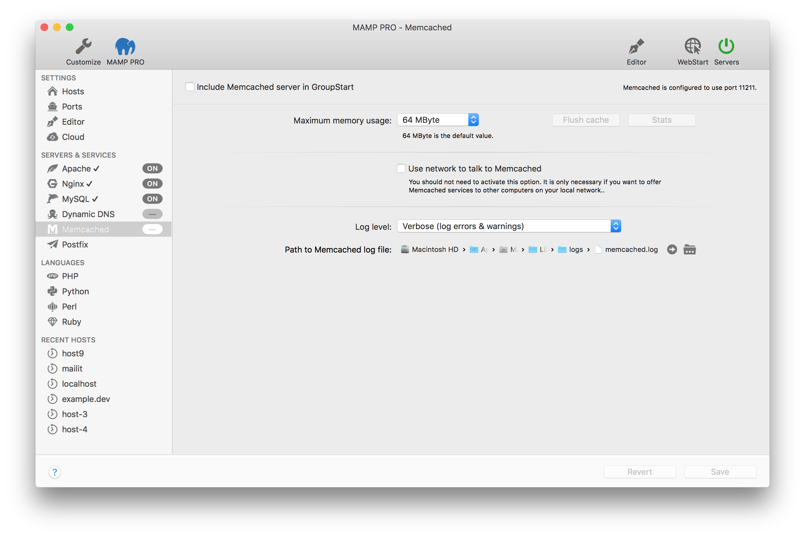

## Servers and Services > Memcached

Memcached is an in-memory key-value store for small chunks of arbitrary data.

*  **Include Memcached server in GroupStart**  

    Check to include the Memcached Server in GroupStart. When activated Memcached will automatically start/stop when the  Servers button is pressed.

---

