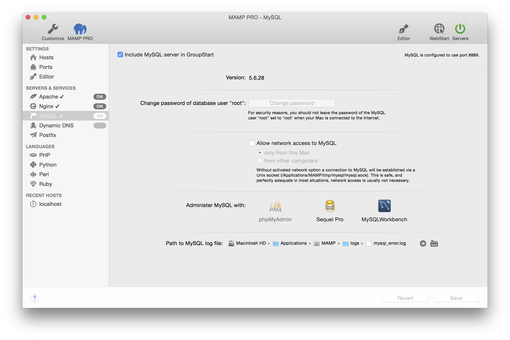

## Servers and Services > MySQL

The MySQL database server is a popular database used on production servers. An installation of MySQL is installed on your computer by MAMP PRO.

*  **Activate MySQL server**
   Check to activate the MySQL Server. MySQL will not start when this checkbox is not checked.

---

*  **Version**
   Change the version of MySQL that will be launched.
   

   Data created using MySQL 5.6 or MySQL 5.7 it will not be accesible when launching MySQL 5.5 
   

*  **Data directory** 
   Displays the location of your MySQL Data. This location cannot be changed.
   

   The MAMP PRO Uninstaller will delete this directory. Make backups before using the uninstller!
   

---

*  **Change password of user "root"**  
   The Head Database Administrator is called root. This user has unlimited access to all databases.
   Therefore you should set the password to one only you know.  
   *Note: The default password of root is "root". To make things even more confusing there is also a user root inside Mac OS X.
    Don't confuse them. You can also use one of the MySQL administration tools to create other MySQL users if you do not want
    to use almighty root.*

---

*  **Allow network access to MySQL**  
   If the checkbox for allow network access to MySQL is not checked, network access to the database is prohibited,
   even from programs installed locally.
   *Note: This is an advanced feature not need for local development.*
 
    *  **only from this Mac**  
       Only programs installed on this Mac can access MySQL via network functions.

    *  **from other computers**  
       MySQL will answer any network request, even from computers on the internet, depending on you network settings.

---

*  **Administer MySQL with**  
   MAMP PRO comes pre-installed with several MySQL administration tools.

    *  **phpMyAdmin** is a web-based administrational tool. It allows you to change data and perform administrative duties
       like creating new databases. See [https://www.phpmyadmin.net](https://www.phpmyadmin.net){:target="_blank"}
      for more information.

    *  **Sequel Pro** is a native Mac application. It allows you to create and visualise database schemas in addition
       to administrative duties.

    *  **MySQLWorkbench** is also a native Mac application from the makers of MySQL. It allows you to visually create database
       schemas in addition to administrative duties.

---

*  **Path to MySQL log file**  
   Errors occurring at startup or during execution of the MySQL server will be saved in this log file.
