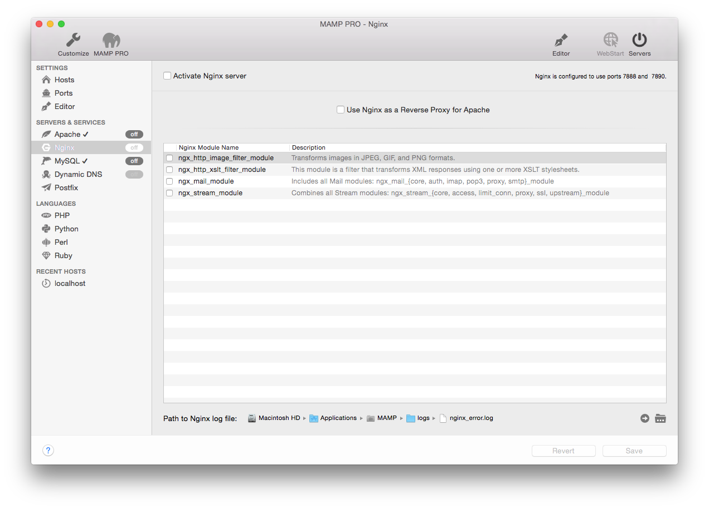

## Servers and Services > Nginx

*  **Activate Nginx server**  

When activated Nginx will automatically start when the Servers button is pressed.

Nginx is a Server ....

Information on how to custom configure your Nginx Server can be found [here](../../Settings/Hosts/Nginx)

*  **Activate Nginx Server**  

---

*  **Use Nginx as a Reverse Proxy for Apache**  

---

*  **Path to Nginx log file**  
