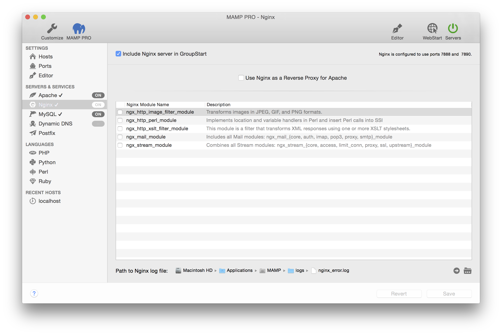

## Servers and Services > Nginx

The Nginx Web Server is a popular web server used in production environments. An instance of Nginx is installed on your Mac by MAMP PRO.

*  **Activate Nginx server**  

    Check to activate the Nginx Server. When activated Nginx will automatically start when the Servers button is pressed.

    Information on how to custom configure your Nginx Server can be found [here](../../Settings/Hosts/Nginx)

---

*  **Use Nginx as a Reverse Proxy for Apache**  

    Check to use Nginx as a revers proxy for Apache.

---

*  **Nginx Modules**

    The Nginx Web Server installed by MAMP PRO comes with several modules pre-installed.

    The web server modules can be activated or deactivated depending on your needs. Module Description provides information pertaining to features and functions of the selected module.

---

*  **Path to Nginx log file**

    Errors occurring during execution of the Nginx server will be saved in this log file.
