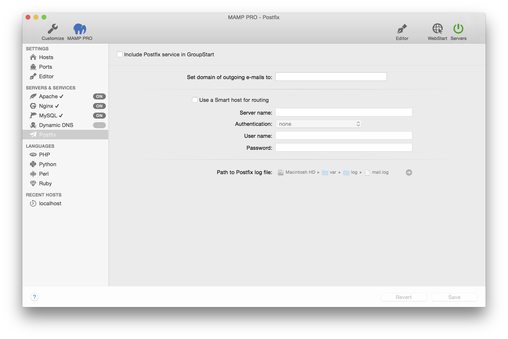

## Servers and Services > Postfix

Sometimes you may need to send an email using PHP. To do so you have to configure and start Postfix. An easy way getting Postfix to run is using the configuration tool built into MAMP PRO.

*  **Include Postfix service in GroupStart**  

Check to include Postfix in the GroupStart. When activated Postfix will automatically start/stop when the Servers button is pressed.

---

*  **Set domain of outgoing e-mails to**

   If you want to use the PHP function `mail()` for sending emails to your own email address (like mail@johndoe.com) you
   just need to open MAMP PRO, go to Server -> Postfix and add the value "johndoe.com" (without quotes and the according
   domain name) into the field "Domain of outgoing mail". Only if you want to send e-mail to others you will need to fill
   in the other fields. In this case make sure that your e-mail provider allows the use of a Smart host.

---

*  **Use a smart host for routing**  

    *  **Server name**  
       Fill in your server name for outgoing emails. This could be for instance "smtp.johndoe.com" (without quotes).
       Ask your provider if you are unsure about the server name.  

    *  **Authentication**  
       Leave to "None"  

    *  **User name**  
       Add the user name of your mail account.  

    *  **Password**  
       Add the password for your email user account.  

   

   Note: Some providers do not allow Smart-Hosts, like Google Mail.
   

---

*  **Path to Postfix log file**  

   More information on how to [Show your Postfix log file](../../How-Tos/#postfix_log) can be found in our How To section.
