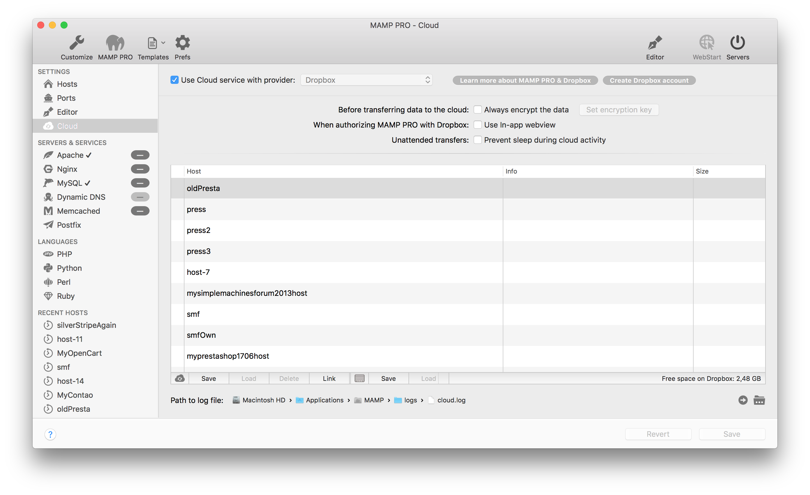

## Settings > Cloud

Sync your host and database data through a cloud provider.

### Linking your cloud account

---

### Overview

---

### Use Cloud with service provider

Use Dropbox to move your files to the cloud.

---

*  **Before transferring data to the cloud : Always encrypt the data**
  
  Use this feature to encrypt data ...
  
*  **When authorizing MAMP PRO with Dropbox : Use in-app webview**
  
  View the Dropbox login page directly through the MAMP PRO app
  
*  **Unattended transfers : Prevent sleeping during cloud activity**
  
  Prevent sleeping ...
  

  

