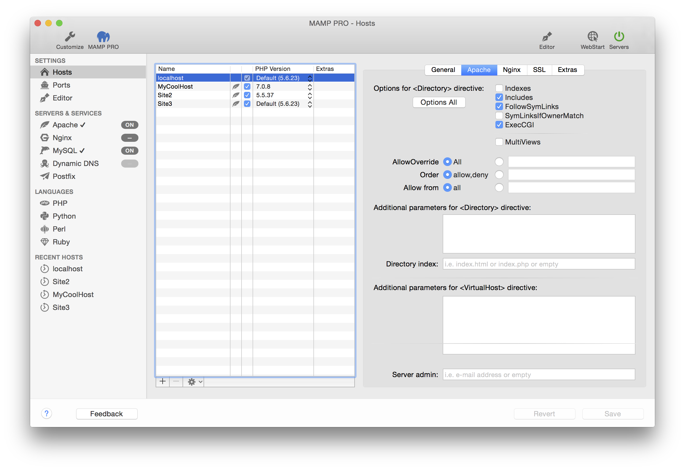

## Settings > Hosts > Apache

Apache options can be set for the selected virtual host in the table. These options are security relevant!

*  **Options for &lt;Directory&gt; directive**  

    *  **Indexes**  
       Activates or deactivates "directory browsing". If there is no index.html, index.php, etc in the document root,
       the content of the folder is displayed when this option is enabled. Without this option, nothing will be displayed
       or an error message will appear.

    *  **Includes** 
       Allows the use of Server Side Includes (SSI).

    *  **FollowSymLinks**  
       Allows the use of symbolic links as reference to documents in other directories. This is an elegant feature if
       you would like to reference to objects, that are outside of the directory tree (e.g. protocol files of the web server),
       but know you want to avoid the hiding of objects through the URL tree.

    *  **SymLinksIfOwnerMatch**  
       Restricted version of "FollowSymLinks". Allows reference to objects via symbolic links only if the owner matches.

    *  **Exec-CGI**  
       Permit CGI execution.

    *  **Multiviews**  
       Allows the use or disabling of dynamic documents depending on the language.

---

*  **Additional parameters for &lt;Directory&gt; directive**  

   *  **Directory Index**  
      Determine which file Apache should serve if no filename is given in a address.
      By default it is either index.html or index.php.

*  **Additional Parameters for &lt;VirtualHost&gt; directive**  
   These directives go directly to the httpd.conf file. 

   *  **Server admin**  
      The email address Apache will send error messages to.

Note: Watch out for typos, they will otherwise prevent Apache from starting up.

---

*  **httpd.conf File**
   You cannot directly you httpd.conf file in MAMP PRO. You need to make custom configurations through your httpd.conf          template file. Information on how to configure your httpd.conf template file can be found                                    [here](../../../Menu).

    [MAMP PRO and httpd.conf, php.ini, my.cnf](https://www.youtube.com/watch?v=uh6s7uMCISU){:target="_blank"}
