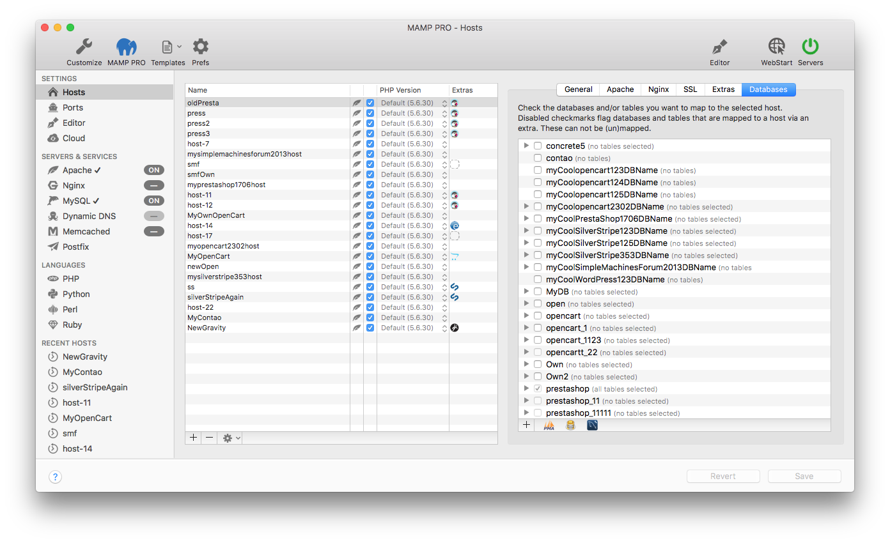

## Settings > Hosts > Databases

The Database tab shows which databases are associated with your host.

The Extras panel shows the name of the extra, how many installations are possible per document root, and the php language version and MySQL compatibility.

- [WordPress](WordPress/)  
- [Joomla](Joomla/)  
- [Drupal](Drupal/) 
- [webEdition](webEdition/)
- [Magento](Magento/)
- [Mediawiki](Mediawiki/) 
- [phpBB](phpBB/) 
- [PrestaShop](PrestaShop/)
- [Concrete5](Concrete5/) 
- [Grav](Grav/) 
- [ForkCMS](ForkCMS/)
- [Bootstrap](Bootstrap/)
- [opencart](opencart/) 
- [SilverStripe](SilverStripe/) 

---

Note: The availability of an Extra will be affected by your hosts PHP version, internet connection, cached Extras and available disk space. To add an Extra, press the plus button on the lower left side of the Extras panel. The plus button has a red circle around it if you have no Extras installed.

