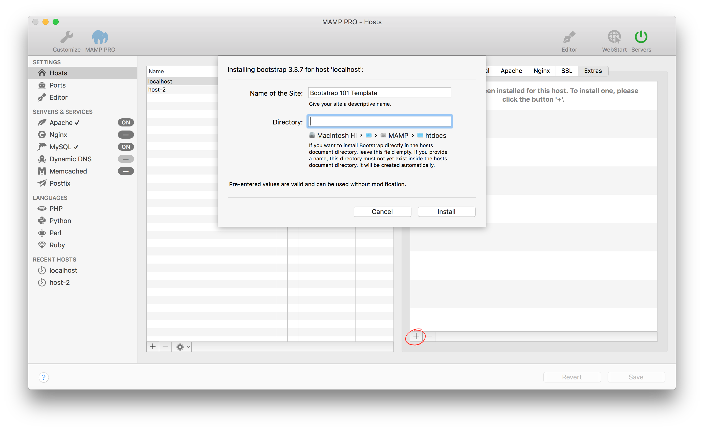

## Settings > Hosts > Extras > Bootstrap

Bootstrap is a popular HTML, CSS, and JS framework. Use the Bootstrap Extra to quickly set up a document root. More information about Bootstrap can be found [here](https://www.getbootstrap.com){:target="_blank"}.

*  **Name of the site:**  
   The name of your site.

