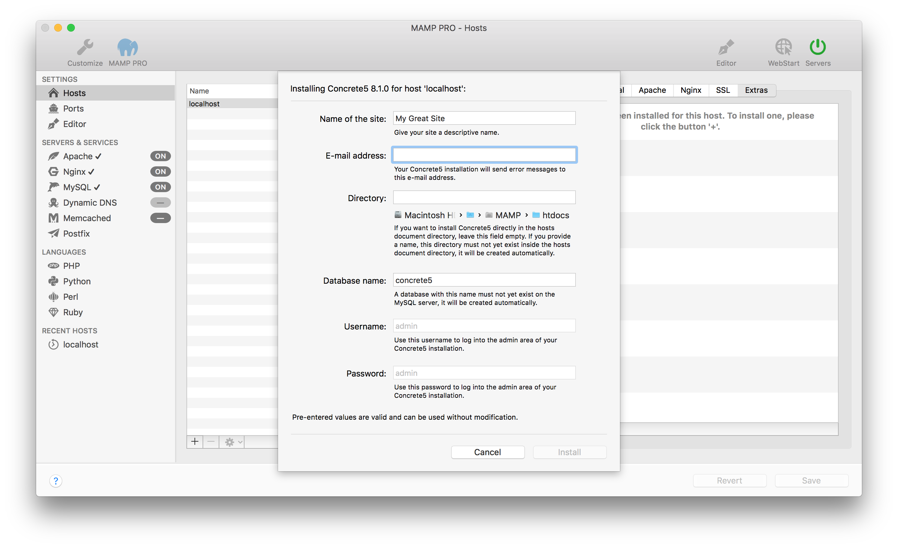

## Settings > Hosts > Extras > Concrete5

Concrete5 is an open source content management system. More information about concrete5 can be found [here](https://www.concrete5.org){:target="_blank"}.

*  **Name of the site:**  
   Name your site.

*  **Email address:**  
   Your email address.  
   
   
 
   Note: You must enter a valid email address to setup a concrete5 installation.
   

*  **Directory:**  
   The installation directory. If it is left blank the Druconcrete5al files will be copied directly to the document root folder.  
  
   
 
   Note: Do not install over a previous installation of concrete5! Files will be overwritten without warning. 
   

*  **Database name:**  
   Set the name of your database schema which will be added to your local database.  
   After installation you can view this database for this instance of WordPress using phpMyAdmin, Sequel Pro, or           MySQLWorkbench. 
 
*  **Username:**  
   The concrete5 admin.
   

   Note: You will need this username to login into your new of concrete5 site, please write this down. 
   

*  **Password:**  
   The concrete5 admins default password.  
   
   
   Note: You will need this password to login into your new concrete5 site, please write this down.
   

