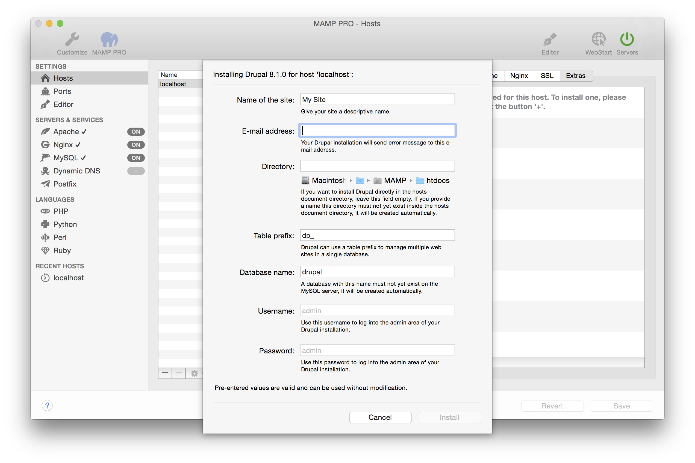

## Drupal

Drupal is content management software. It's used to make many of the websites and applications you use every day. More information about Drupal can be found [here](https://www.drupal.org){:target="_blank"}.

*  **Name of the site:**  
   Name your site.

*  **Email address:**  
   Your email address.  
   *Note: You must enter a valid email address to setup a WordPress installation.*

*  **Directory:**  
   The installation directory. If it is left blank the Wordpress files will be copied directly to the document root folder.  
   
*Note: Do not install over a previous installation of Wordpress! Files will be overwritten without warning.*  

*  **Table Prefix:**  
   The table prefix for your site.

*  **Database name:**  
   Set the name of your database schema which will be added to your local database.  
   After installation you can view this database for this instance of WordPress using phpMyAdmin, Sequel Pro, or                MySQLWorkbench. 
 
*  **Username:**  
   The Drupal admin.  
   *Note: You will need this username to login into your new of Drupal site, please write this down.*  

*  **Password:**  
   The Drupal admins default password.  
   *Note: You will need this password to login into your new Drupal site, please write this down.*

