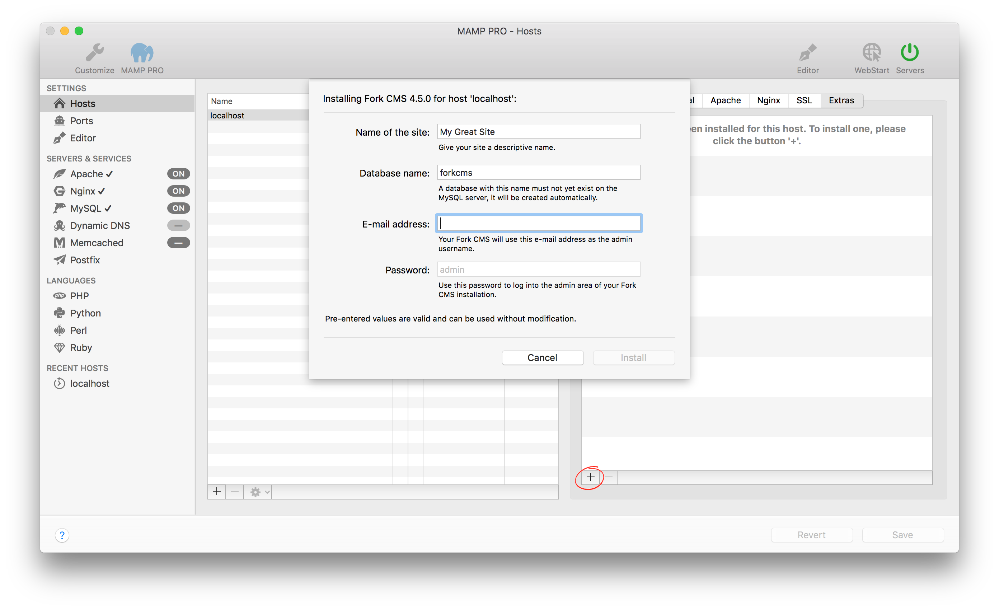

## Settings > Hosts > Extras > ForkCMS

Fork is content management software. It's used to make many of the websites and applications you use every day. More information about Fork can be found [here](https://www.fork-cms.com){:target="_blank"}.

*  **Name of the site:**  
   Name your site.

*  **Database name:**  
   Set the name of your database schema which will be added to your local database.  
   After installation you can view this database for this instance of WordPress using phpMyAdmin, Sequel Pro, or           MySQLWorkbench. 

*  **Email address:**  
   Your email address.  
   
   
 
   Note: You must enter a valid email address to setup a Fork installation.
   

   
*  **Password:**  
   The Fork admins default password.  
   
   
   Note: You will need this password to login into your new Fork site, please write this down.
   

