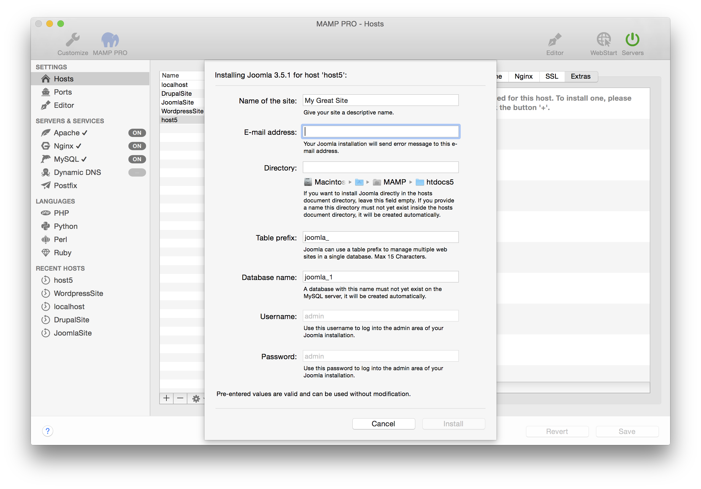

## Joomla

Joomla is a free and open-source content management system. More information about Joomla can be found here.

Joomla installations can share a single MySQL database if you provide a unique table prefix during installation. To use an existing database enter the name of the database and a unique table prefix. To create a new database use a unique database name, table prefix must not be empty.

*  **Table prefix:**  
   Set the name of your database schema prefix. Joomla offers the ability to manage multiple websites using a single database schema.

*  **Database name:**  
   Set the name of your database schema which will be added to your local database.
   After installation you can view this database for this instance of Joomla using phpMyAdmin, Sequel Pro, or MySQLWorkbench. 

