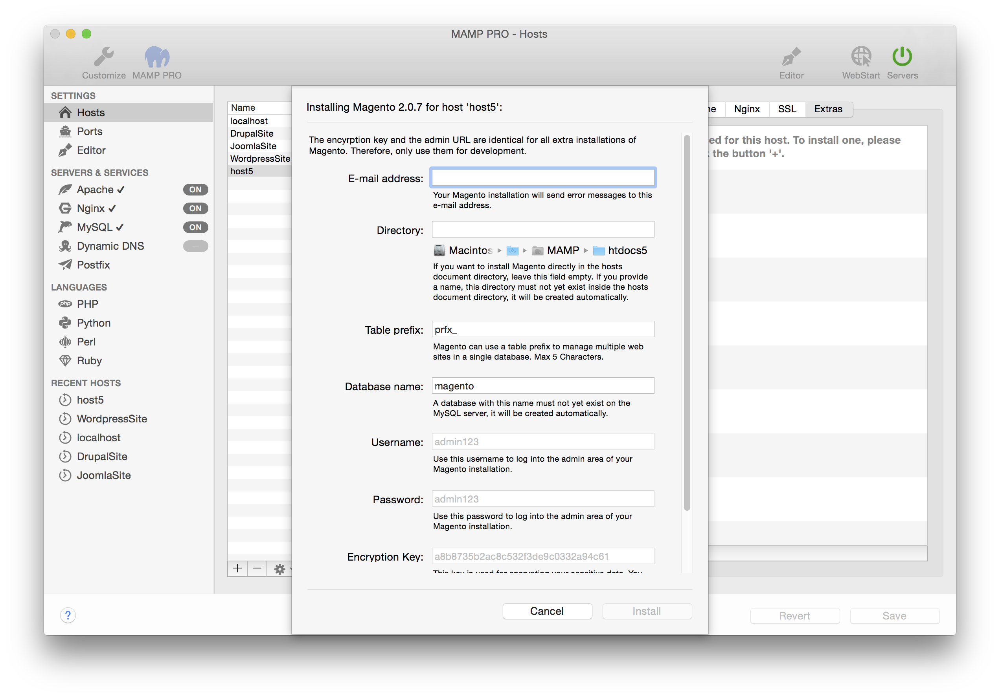

## Magento

Magento Commerce is the leading provider of open omnichannel innovation. Our open source digital commerce platform and cloud-based omnichannel solutions empower merchants to integrate digital and physical shopping experiences.

*  **Email address:**  
   Your email address.  
   *Note: You must enter a valid email address to setup a WordPress installation.*

*  **Directory:**  
   The installation directory. If it is left blank the Wordpress files will be copied directly to the document root folder.  
   *Note: Do not install over a previous installation of Wordpress! Files will be overwritten without warning.*  

*  **Table Prefix:**  
   Magento can use a table prefix to manage multiple web sites in a single database. The prefix has a maximum of five characters.

*  **Database name:**
   Set the name of your database schema which will be added to your local database.  
   After installation you can view this database for this instance of WordPress using phpMyAdmin, Sequel Pro, or           MySQLWorkbench. 
 
*  **Username:**  
   The WordPress admin.  
   *Note: You will need this username to login into your new of WordPress blog, please write this down.*  

*  **Password:**  
   The WordPress admins default password.  
   *Note: You will need this password to login into your new WordPress blog, please write this down.*

*  **Encryption Key:**
   
   This key is used for encrypting your sensitive data. You will need it if you move your data to a different Magento installation. Some payment and shipment processors require it. The key is located in <document root>/app/etc/env.php . 

