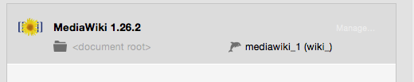

## Mediawiki

MediaWiki is a free software open source wiki package written in PHP, originally for use on Wikipedia. It is now also used by several other projects of the non-profit Wikimedia Foundation and by many other wikis.

*  **Name of Wiki:**  
   Your Wiki a descriptive name.

*  **Email address:**  
   Your email address.  
   *Note: You must enter a valid email address to setup a Mediawiki installation.*

*  **Directory:**  
   The installation directory. If it is left blank the Mediawiki files will be copied directly to the document root folder.  
   *Note: Do not install over a previous installation of Mediawiki! Files will be overwritten without warning.*  

*  **Table prefix:**  
   Mediawiki can use a table prefix to manage multiple forums in a single database.

*  **Database name:**  
   Set the name of your database schema which will be added to your local database.  
   After installation you can view this database for this instance of Mediawiki using phpMyAdmin, Sequel Pro, or           MySQLWorkbench. 
 
*  **Username:**  
   The Mediawiki admin.  
   *Note: You will need this username to login into your new of Mediawiki blog, please write this down.*  

*  **Password:**  
   The Mediawiki admins default password.  
   *Note: You will need this password to login into your new Mediawiki blog, please write this down.*

When you are done filling out all the required fields Mediawiki will be downloaded into your host directory. A database will be created using the database name you entered.

The <document root> indicates you installed Mediawiki directly in the document root and not a subfolder. mediawiki_1 indicates the database name and (wiki_) indicates the table prefix name. You can go directly to your host site by pressing the 'manage...' button

