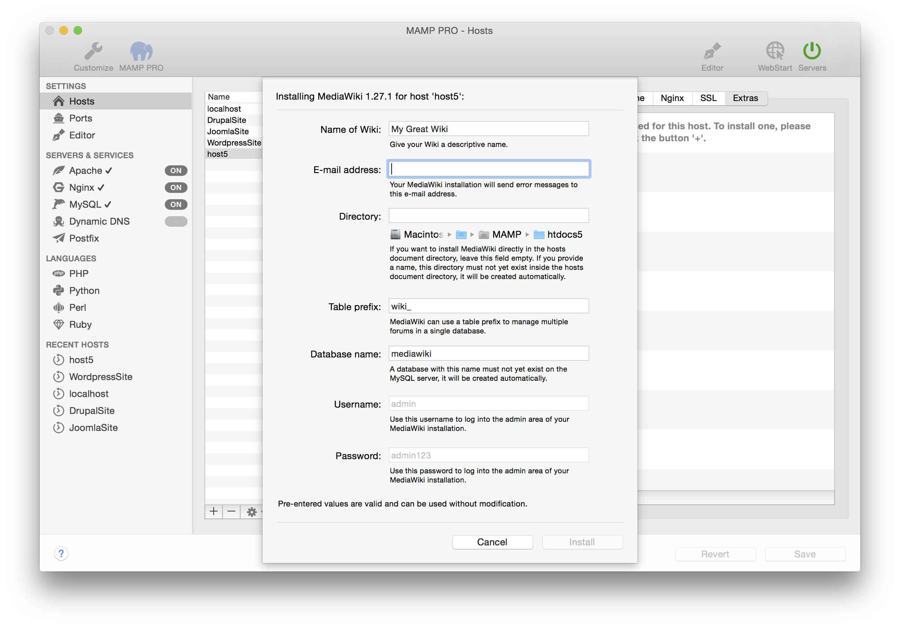

## Mediawiki

MediaWiki is a free software open source wiki package written in PHP, originally for use on Wikipedia. It is now also used by several other projects of the non-profit Wikimedia Foundation and by many other wikis.

*  **Name of the blog:**  
   Name your blog.

*  **Email address:**  
   Your email address.  
   *Note: You must enter a valid email address to setup a WordPress installation.*

*  **Directory:**  
   The installation directory. If it is left blank the Wordpress files will be copied directly to the document root folder.  
   *Note: Do not install over a previous installation of Wordpress! Files will be overwritten without warning.*  

*  **Database name:**  
   Set the name of your database schema which will be added to your local database.  
   After installation you can view this database for this instance of WordPress using phpMyAdmin, Sequel Pro, or                MySQLWorkbench. 
 
*  **Username:**  
   The WordPress admin.  
   *Note: You will need this username to login into your new of WordPress blog, please write this down.*  

*  **Password:**  
   The WordPress admins default password.  
   *Note: You will need this password to login into your new WordPress blog, please write this down.*

