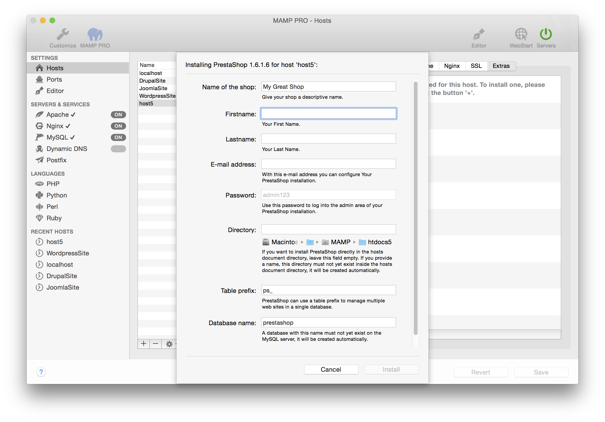

## Prestashop

*  **Name of the blog:**  
   Name your blog.

*  **First Name:**  
   Your first name.

*  **Last Name:**  
   Your last name.

*  **Email address:**  
   Your email address.  
   *Note: You must enter a valid email address to setup a PrestaShop installation.*

*  **Password:**  
   The PrestaShop admins default password.  
   *Note: You will need this password to login into your new PrestaShop blog, please write this down.*

*  **Directory:**  
   The installation directory. If it is left blank the PrestaShop files will be copied directly to the document root folder.  
   *Note: Do not install over a previous installation of Prestashop! Files will be overwritten without warning.*  

*  **Table prefix:**  
   Set the name of your database schema which will be added to your local database.  

*  **Database name:**  
   Set the name of your database schema which will be added to your local database.  
   After installation you can view this database for this instance of PrestaShop using phpMyAdmin, Sequel Pro, or           MySQLWorkbench. 

