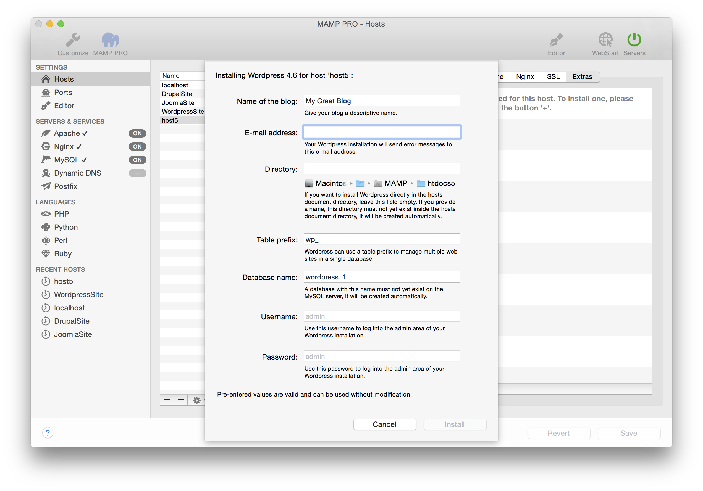

## Wordpress

WordPress is a free and open-source content management system based on PHP and MySQL. More information about Wordpress can be found [here](https://www.wordpress.org){:target="_blank"}.

Note: When some Content Management Systems such as Wordpress are setup the host name and Apache port number are stored in their database. Going forward the Apache port in MAMP PRO cannot be changed. A change in the Apache port will result in breaking the CMS, returning only a vague error message. Content Management Systems usually provide a mechanism for changing the host and port names. If changes are made in the CMS, then they must also be made in MAMP PRO.

*  **Name of the blog:**  
   Name your blog.

*  **Email address:**  
   Your email address.  
   
 
   Note: You must enter a valid email address to setup a WordPress installation.
   

*  **Directory:**  
   The installation directory. If it is left blank the Wordpress files will be copied directly to the document root folder.  
   
    
   Note: Do not install over a previous installation of Wordpress! Files will be overwritten without warning.  
   

*  **Table prefix:**  
   Set the name of your database schema prefix. Wordpress offers the ability to manage multiple websites using a single database schema.

*  **Database name:**  
   Set the name of your database schema which will be added to your local database.  
   After installation you can view this database for this instance of WordPress using phpMyAdmin, Sequel Pro, or           MySQLWorkbench. 
 
*  **Username:**  
   The WordPress admin.
   
 
   Note: You will need this username to login into your new of WordPress blog, please write this down.
   

*  **Password:**  
   The WordPress admins default password.  
   
 
   Note: You will need this password to login into your new WordPress blog, please write this down.
   

 [Installing wordPress with Extras and Manually](https://www.youtube.com/watch?v=6rMFZa2TOjg){:target="_blank"}

