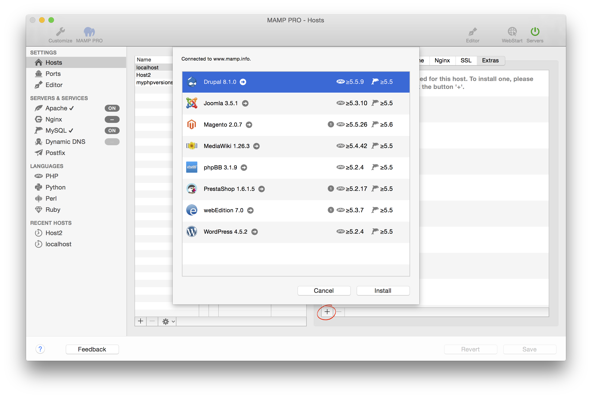

## Extras

MAMP PRO Extras allow you the ability to install a content management system in just a few clicks.

The Extras panel shows the name of the extra, how many installations are possible per document root, and the php compatibility.

- [WordPress](WordPress/)  
- [Joomla](Joomla/)  
- [Drupal](Drupal/) 
- [webEdition](webEdition/)
- [Magento](Magento/)
- [Mediawiki](Mediawiki/) 
- [phpBB](phpBB/) 
- [PrestaShop](PrestaShop/) 

---

Note: The availability of an Extra will be affected by your hosts PHP version, internet connection, cached Extras and available disk space. To add an Extra, press the plus button on the lower left side of the Extras panel. The plus button has a red circle around it if you have no Extras installed.

