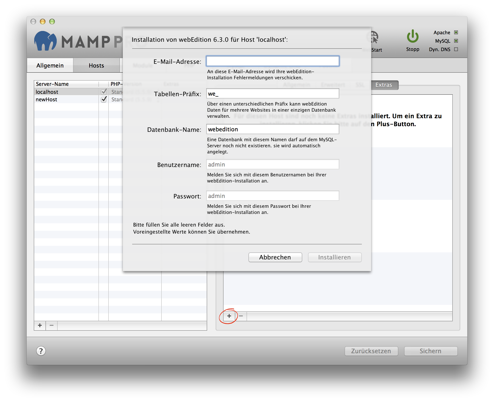

## Settings > Hosts > Extras

MAMP PRO allows you to easily add popular packages to your hosts which we call Extras. Extras will always be loaded from the appsolute servers if you have an Internet connection.

Note: The availability of an Extra will be affected by your hosts PHP version, internet connection, cached Extras and available disk space. To add an Extra, press the plus button on the lower left side of the Extras panel. The plus button has a red circle around it if you have no Extras installed.

---

### Joomla

Joomla installations can share a single MySQL database if you provide a unique table prefix during installation. To use an existing database enter the name of the database and a unique table prefix. To create a new database use a unique database name, table prefix must not be empty.

*  **Table prefix:**  
   Set the name of your database schema prefix. Joomla offers the ability to manage multiple websites using a single database schema.

*  **Database name:**  
   Set the name of your database schema which will be added to your local database.
   After installation you can view this database for this instance of Joomla using phpMyAdmin, Sequel Pro, or MySQLWorkbench. 

---

### webEdition

webEdition will always be installed in a folder called webEdition inside the document root folder.

*  **Table prefix:**  
   Set the name of your database schema prefix. webEdition offers the ability to manage multiple websites
   using a single database schema.

*  **Database name:**  
   Set the name of your database schema which will be added to your local database.
   After installation you can view this database for this instance of webEdition using phpMyAdmin, Sequel Pro, or               MySQLWorkbench. 

Note: When a Content Management System is setup the host name and Apache port number is stored in its database. Going forward the Apache port in MAMP PRO cannot be changed. A change in the Apache port will result in breaking the CMS, returning only a vague error message. Content Management Systems usually provide a mechanism for changing the host and port names. If changes are made in the CMS, then they must also be made in MAMP PRO.

