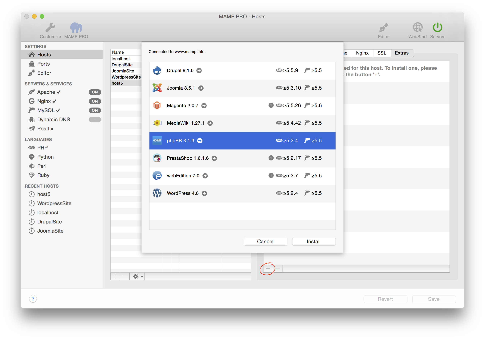

## phpBB

phpBB is an Internet forum package written in the PHP scripting language. 

*  **Email address:**  
   Your email address. You phpBB installation will send error messages to this e-mail address.
   *Note: You must enter a valid email address to setup a phpBB installation.*

*  **Directory:**  
   The installation directory. If it is left blank the phpBB files will be copied directly to the document root folder.  
   *Note: Do not install over a previous installation of phpBB! Files will be overwritten without warning.*  

*  **Table Prefix:**  
   phpBB can use a table prefix to manage multiple forums in a single database. 

*  **Database name:**  
   Set the name of your database schema which will be added to your local database.  
   After installation you can view this database for this instance of phpBB using phpMyAdmin, Sequel Pro, or           MySQLWorkbench. 
 
*  **Username:**  
   The phpBB admin.  
   *Note: You will need this username to login into your new of phpBB installation, please write this down.*  

*  **Password:**  
   The phpBB admins default password.  
   *Note: You will need this password to login into your new phpBB installation, please write this down.*

