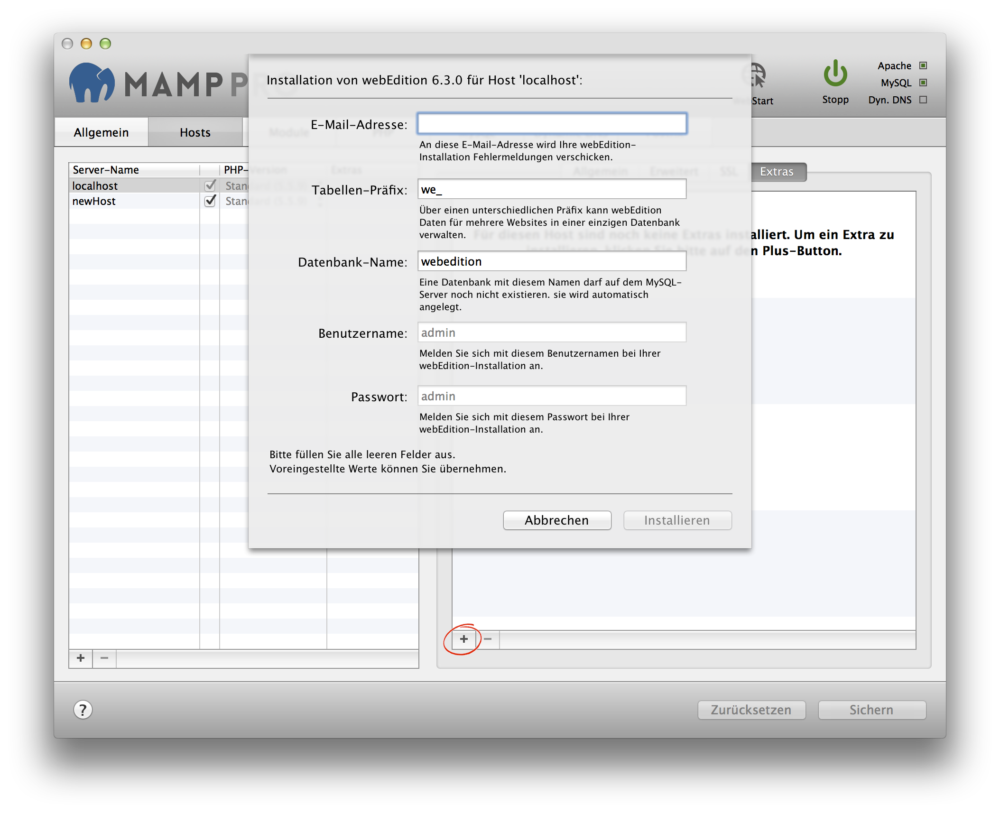

## webEdition

webEdition will always be installed in a folder called webEdition inside the document root folder.

*  **Email address:**  
   Your email address.  
   *Note: You must enter a valid email address to setup a WordPress installation.*

*  **Table prefix:**  
   Set the name of your database schema prefix. webEdition offers the ability to manage multiple websites
   using a single database schema.

*  **Database name:**  
   Set the name of your database schema which will be added to your local database.
   After installation you can view this database for this instance of webEdition using phpMyAdmin, Sequel Pro, or               MySQLWorkbench.

*  **Username:**  
   The webEdition admin.  
   *Note: You will need this username to login into your new webEdition site, please write this down.*  

*  **Password:**  
   The WebEdition admins default password.  
   *Note: You will need this password to login into your new webEdition site, please write this down.*

