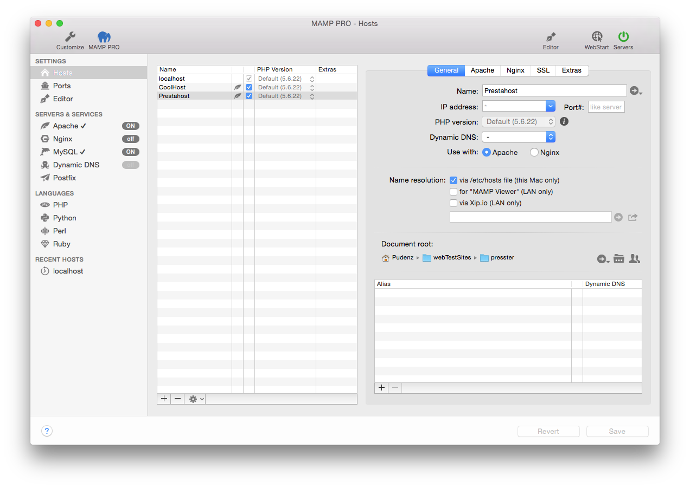
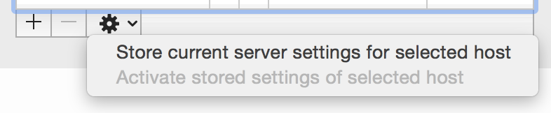
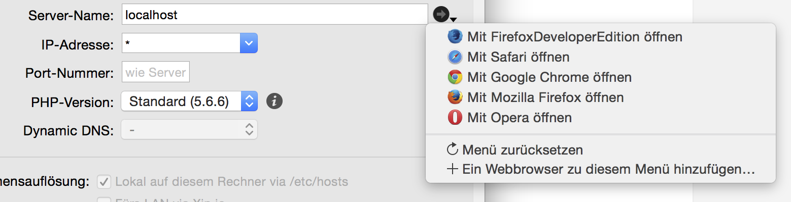
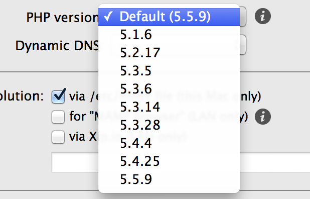

## Settings > Hosts > General

MAMP PRO uses virtual hosts to allow your web servers to serve different websites. The virtual host `localhost` is created by default and cannot be deleted. You can add an unlimited number of hosts allowing you to create one host per project. Every host can have it's own directory to store html, php files, and images. This directory is called Document Root.

The name of a host (server name) must be unique, often it's practical to use a reverse domain naming scheme to easily identify them (e.g. use de.appsolute.mamp instead of mamp.appsolute.de). The unreversed name may conflict with an outside domain name.

To create a new host press the `Plus` button at the bottom left of the screen. Replace the default host name. The second required field to complete the setup of a new host is a location for its files document root.   

Click on the folder icon to choose a document root. Use the right arrow button to open the folder in the Finder.

The document root is also known as the web root folder. MAMP PRO will automatically add an `index.php` file and a MAMP image to this location when your web server is restarted and the folder is empty.

*  **Hosts Table**

   The hosts table contains five columns. The first column contains your host name. The second column indicates which web server will host the file. 

   The third column indicates whether the host is active. If left unchecked, the host will not be active and cannot be viewed in a web browser.

   The fourth column contains the php version that is used with host. The fifth column will display an icon of the Extra installed if an Extra is installed.

   When your host page is functioning or at any other time you can save your host settings so you can go back to them at a later date. This serves as a backup in the case you make some server changes and discover your site is no longer accessible.

   

---

*  **Name**  
   The server name and port number in combination must be unique within MAMP PRO.
   The host name may only contain letters and/or numbers, as well as dashes ("-");
   but it may not begin or end with a "-" character.
   Names are not case-sensitive (upper and lower-case letters are not distinguished.)

   If the servers are running you can use the right arrow button to open a host in your web browser.

  

*  **IP address**  
   If this field is left empty or contains an `*` the web server will use one of the computer's IP addresses to access this host.
   If you want to choose which of the IP addresses should be associated with a host, then select it from the pop up menu.

*  **Port#**  
   Determine the port with which the virtual host is accessible. Valid values are from 1 to 65535.
   In most cases the preset value does not need to be changed.

*  **PHP Version**  
   Determine which version of PHP a host will use. This can only be set when Individual PHP version
   for every host (CGI) is set in the PHP section of MAMP PRO.

   If you select the Standard PHP version MAMP PRO will automatically adapt this setting if you choose
   a new standard version in the PHP tab. Use a fixed setting to tell MAMP PRO not to alter the PHP version.
   
      

   Sounds complicated? Let's take a look at an example: The default version is set to 5.5.9. You have oneHost
   set to PHP version `Default (5.5.9)`, anotherHost set to `5.5.9` and yetAnotherHost set to `5.3.28`.
   If you set the PHP version in the PHP section to `5.4.25`, MAMP PRO will adapt the PHP version of oneHost
   to this version (it is set to always use the standard version). The other 2 hosts will not be changed.
  
      [Setting Your PHP Version in MAMP              PRO](https://www.youtube.com/watch?v=fsOWq9k_OAc){:target="_blank"}.

      *  **PHPInfo**
      
         
      
         View your php configuration by pressing the 'i' button to the right of the version name.
      
*  **Dynamic DNS**  
   Determines, if this virtual host is accessible with the Dynamic DNS service from the internet.

*  **Use with**  
    Determine which web server will be used with your host. An icon next to the server name in the server list will also indicate which web server you chose.

---

*  **Name resolution**  
   This will determine how your system will map host names to ip addresses.

    *  **via /etc/host file (this Mac only)**  
       The basic mapping mechanism which uses the the file `/etc/hosts`.

    *  **for "MAMP Viewer" (LAN only)**  
         Enable your host to be viewed on the MAMP Viewer.

    *  **via Xip.io (LAN only)**  
       Allow other computers on your local network to access your web site.
       Using the Share button you can send the Xip.io address to other users.
      
         

         Note: The Xip.io addresses will only work in your local network. They are temporary and may become invalid
         if you restart your Mac. Also make sure that your Internet router is not blocking Xip.io calls by using a DNS               Rebind protection. If the router does this you can either deactivate this function, add Xip.io as an exception or           not use the router as DNS server in your Macs network settings.
         

      
          [Viewing On Mobile                             Device](https://www.youtube.com/watch?v=sYHPYCDvU1Q){:target="_blank"}

*  **Document root**  
   The location of the documents (HTML/PHP files etc.) of a virtual host is called a document root.

*  **Access Rights for Document Root Directory**  
   For the web server to be able to access the files inside the document root folder and serve them to a web browser it needs adequate rights.
   If you use the user `www` to start your web server, then this user must have the right to access the files inside the document root folder. Typically this is not the case. You can either adapt the access rights or use the current Mac user to start your web servers.

   During the development phase of a site it is easier to use the current Mac user to start your web server.
   The user `www` is generally only used on production servers.

   If your web server is reporting "access denied" in its error log or parts of your web pages are missing this might be due to access rights problems.

   The rights dialog of MAMP PRO looks complicated at first sight but is actually very powerful. Not only does it show you
   the access rights of the document root folder but also all the rights of all the subdirectories and files inside it.
   A "-" indicates that not all objects have the same rights.

    *  **Owner**  
       The user who owns the directory and all the subdirectories and files in it.
       *  **change to**  

    *  **Group**  
       The group who has access to the directory and all the subdirectories and files in it.
       *  **change to**  

    *  **Access Rights**  
       You can change directory and files access rights separately.
       *  **Change directory right**
       *  **Change file right**  

*  **Alias Name**  
   Aliases are additional names for your virtual host. The same constraints apply to these additional names as to the host itself. Add aliases with the plus-button.
