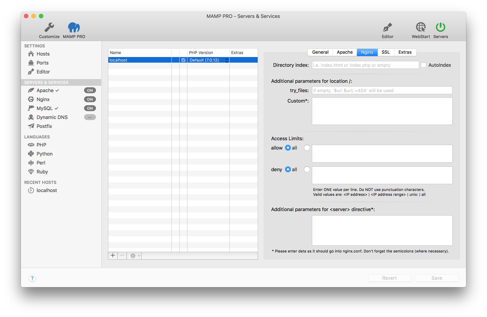

## Settings > Hosts > Nginx

Nginx options can be set for the selected virtual host in the table. These options are security relevant!

*  **Directory index**  

   Determine which file Nginx should serve if no filename is given in an address. By default it is either index.html or index.php.
   
*  **AutoIndex**

   Activates or deactivates "directory browsing". If there is no index.html, index.php, etc in the document root, the content of the folder is displayed when this option is enabled. Without this option, nothing will be displayed or an error message will appear.

*  **Access Limits**  

    *  **allow**
    
    Put an access limit here ...
    
    *  **deny**
    
    Put an access limit here ... 
    
*  **Additional parameters for &lt;server&gt; directive**

   Add additional parameters to the &lt;server&gt; directive here.  

Note: Watch out for typos, they will otherwise prevent Nginx from starting up.

---

*  **httpd.conf File**
   You cannot directly edit your httpd.conf file in MAMP PRO. You need to make custom configurations through your httpd.conf template file. More information on how to [configure your httpd template file](../../../Menu/File#edit_templates) can be found in our Menu > File section.

    [MAMP PRO and httpd.conf, php.ini,                      my.cnf](https://www.youtube.com/watch?v=uh6s7uMCISU){:target="_blank"}

