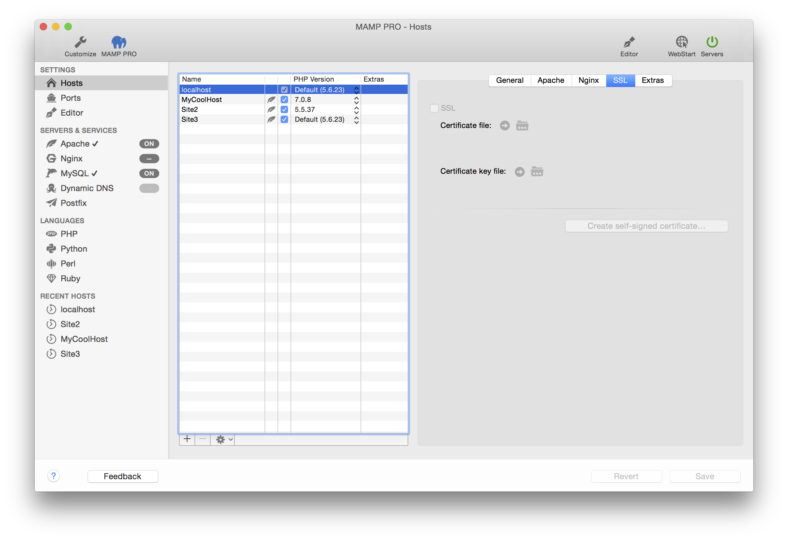
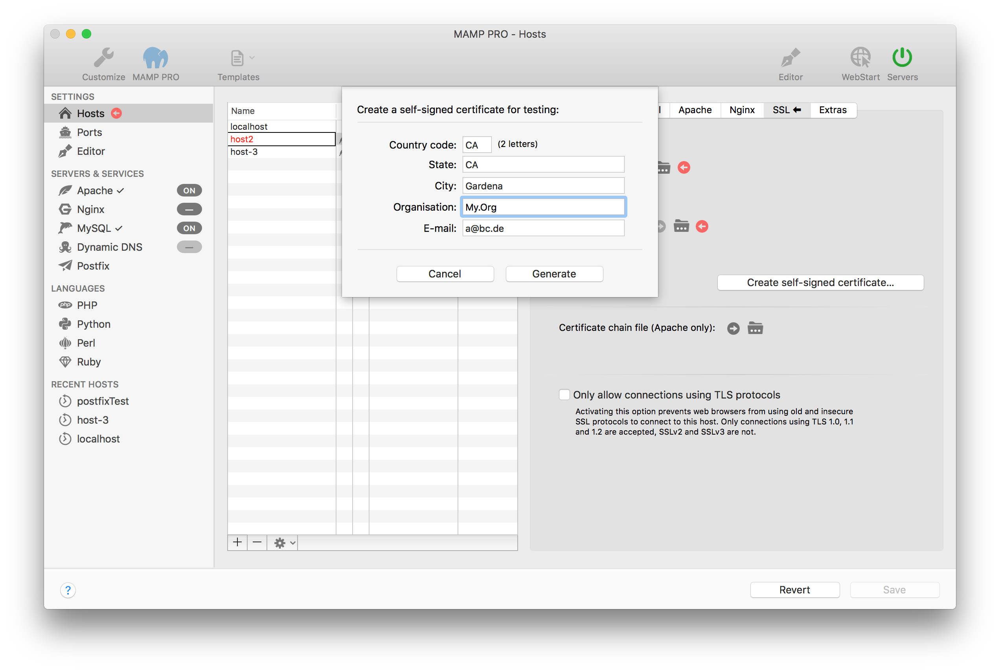

## Settings > Hosts > SSL

To encrypt traffic from Apache to a web browser you can use SSL.

Use "Create self-signed certificate..." if you want to test SSL functionality.

If you want to secure a productive server you should get the Certificate file and the Certificate key file from a Certified Authority (CA).

*  **SSL**
 
   Check to enable SSL. After creating or enabling your SSL certificates your sites will now use https.

   *  **Certificate File**  
       Point to your certificate file.

   *  **Certificate Key File**  
       Point to your certificate key file.
       
   *  **Certificate Self Signed Certificate**  
       Use this dialogue to create a dummy self signed certificate. Your browser will not recognize this certificate, and you       will have to click through warnings when viewing your site in a browser.

 
 
---
 
   *  **Certificate Chain File (Apache Only)**  
       Point.
       
---

*  **Only allow connection using TLS protocols**
