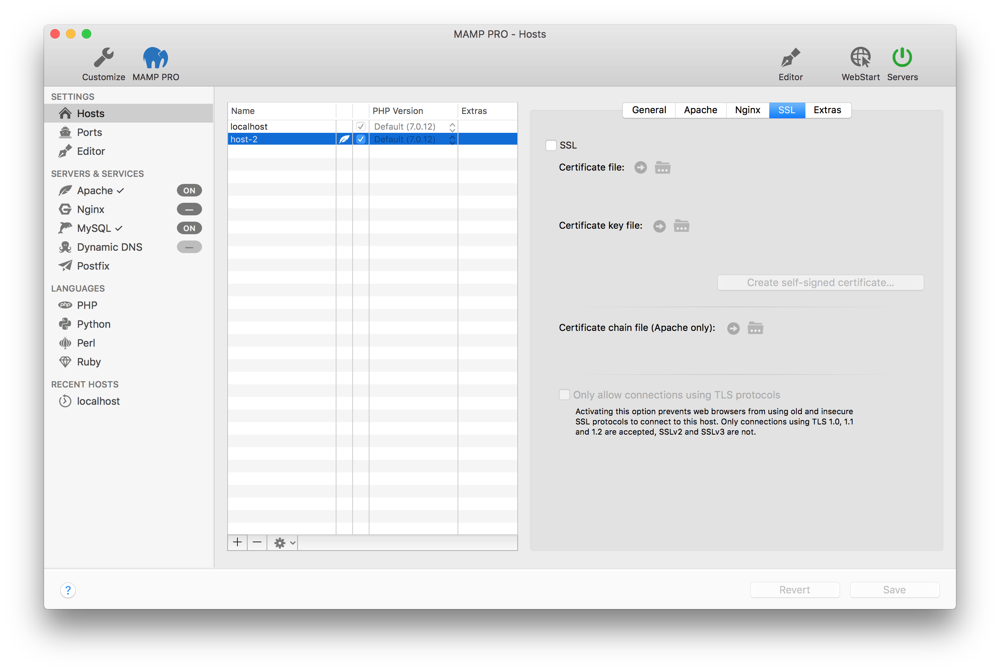

## Settings > Hosts > SSL

To encrypt traffic from Apache to a web browser you can use SSL. If you would like to secure a productive server you should get the Certificate file and the Certificate key file from a Certified Authority (CA). You can use a "dummy" certificate for testing SSL functionality.

*  **SSL**
 
   Check to enable SSL. After creating or enabling your SSL certificates your sites will now use https.

   *  **Certificate File**  
       Point to your certificate file. The directory dialogue will only recognize .crt files.

   *  **Certificate Key File**  
       Point to your certificate key file. The directory dialogue will only recognize .key files.
       
   *  **Certificate Self Signed Certificate**  
       Use "Create self-signed certificate..." if you want to test SSL functionality. Your browser will not recognize this certificate, and you will have to click through warnings when viewing your site in a browser.

 
 
---
 
   *  **Certificate Chain File (Apache Only)**  
       Point.
       
---

*  **Only allow connection using TLS protocols**

   Activating this option prevents web browsers from using old and insecure SSL protocols to connect to this host. Only  connections using TLS 1.0, 1.1 and 1.2 are accepted, SSLv2 and SSLv3 are not.
